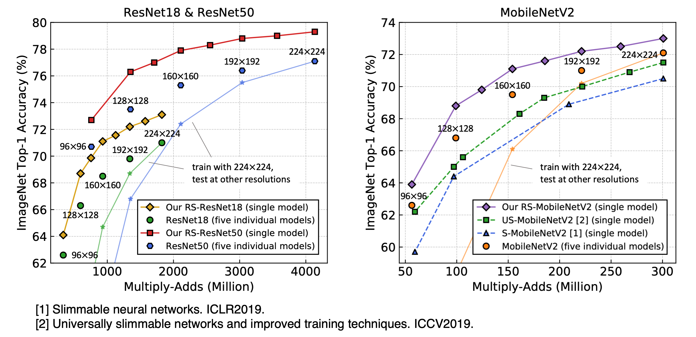
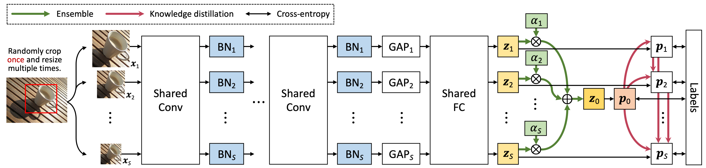

# RS-Nets: Resolution Switchable Networks

By Yikai Wang, Fuchun Sun, Duo Li and Anbang Yao.

This repository is an official implementation of "Resolution Switchable Networks for Runtime Efficient Image Recognition", accepted by ECCV 2020. We provide PyTorch implementation for non-quantization and TensorFlow implementation for quantization. Experiments are conducted on the [ILSVRC 2012](http://www.image-net.org) benchmark.


<p align="center"></p>
ImageNet accuracy vs. FLOPs (Multiply-Adds) of our single models and the corresponding sets of individual models. A single RS-Net model is executable at each of the resolutions, and achieves higher accuracies than individual models.


<p align="center"></p>
Overall framework of training a RS-Net. Images with different resolutions are trained in parallel with shared Conv/FC layers and private BNs. The ensemble logit is learned on the fly as a weighted mean of logits, shown as green arrows. Knowledge distillations are shown as red arrows. For inference, one of the forward paths is selected, with its corresponding BNs, for obtaining its corresponding prediction. The ensemble and knowledge distillation are not needed during inference.

## Dataset
Following [this repository](https://github.com/pytorch/examples/tree/master/imagenet#requirements),
- Download the ImageNet dataset from http://www.image-net.org/.
- Then move validation images to labeled subfolders, using [the following script](https://raw.githubusercontent.com/soumith/imagenetloader.torch/master/valprep.sh).

## Non-Quantization

### Requirements

- Python >= 3.6
- PyTorch >= 1.0
- torchvision
- tensorboardX

### Pretrained Models


Basic results comparison on ImageNet. Performance is measured by top-1 / top-5  accuracies (%).


|Resolution|  ResNet18   |  ResNet50   | MobileNetV2 | 
|:----------:|:-------------:|:-------------:|:-------------:|
| 224x224  | 73.1 / 91.0 | 79.3 / 94.6 | 73.0 / 90.8 |
| 192x192  | 72.2 / 90.6 | 78.8 / 94.4 | 72.2 / 90.5 | 
| 160x160  | 71.1 / 90.1 | 77.9 / 93.9 | 71.1 / 90.2 | 
| 128x128  | 68.7 / 88.5 | 76.3 / 93.0 | 68.8 / 88.2 | 
|  96x96   | 64.1 / 85.3 | 72.7 / 91.0 | 63.9 / 84.9 |  
| Download |[Google Drive](https://drive.google.com/drive/folders/1NsdxK_y6CPfJ7s3NHWwU0nIfd5LaIwnu?usp=sharing)|[Google Drive](https://drive.google.com/drive/folders/1jYLK-pZvNCzyluum5YgJXf87gFmK9EEJ?usp=sharing)|[Google Drive](https://drive.google.com/drive/folders/183Arvf6o4GxCZle57V0VmDRh0Twrdc97?usp=sharing)|


### Training / Testing Scripts
First move to the non-quantization folder,
```shell
cd non-quantization
```

For training ResNet18 or ResNet50,

```shell
python imagenet.py \
    --arch parallel_resnet18 \  # or parallel_resnet50
    --data <path-to-data> \  # e.g., ../data/ILSVRC2012
    --workers <num-workers>  # e.g., 16
    --epochs 120 \
    --checkpoint <path-to-checkpoint> \
    --sizes 224 192 160 128 96 \
    --kd \
    --kd-type ens_topdown
```

For training MobileNetV2,
```shell
python imagenet.py \
    --arch parallel_mobilenetv2 \
    --data <path-to-data> \
    --workers <num-workers>
    --epochs 150 \
    --lr 0.05 \
    --wd 4e-5 \
    --checkpoint <path-to-checkpoint> \
    --sizes 224 192 160 128 96 \
    --kd \
    --kd-type ens_topdown
```

For testing ResNet18, ResNet50 or MobileNetV2,

```shell
python imagenet.py \
    --arch <model-architecture> \  # e.g., parallel_resnet18
    --data <path-to-data> \
    --workers <num-workers>
    --eval \
    --resume <path-to-checkpoint> \
    --sizes 224 192 160 128 96 \
```


## Quantization

This part of code is built on [the repository of LQ-Nets](https://github.com/microsoft/LQ-Nets).

### Requirements

- Python >= 3.6
- Python bindings for OpenCV
- TensorFlow >= 1.3
- [TensorPack](https://github.com/tensorpack/tensorpack)

### Pretrained Models


Results comparison for quantization tasks on ImageNet, including two kinds of bit-widths (W / A). Performance is measured by top-1 / top-5  accuracies (%).

|Resolution|ResNet18 (2 / 32)|ResNet50 (2 / 32)|ResNet18 (2 / 2)|ResNet50 (2 / 2)|
|:----------:|:-----------------:|:-----------------:|:----------------:|:----------------:|
| 224x224  |   68.8 / 88.4   |   76.0 / 92.8   |   65.8 / 86.4  |   74.0 / 91.5  |
| 192x192  |   67.6 / 87.8   |   75.1 / 92.4   |   64.8 / 85.8  |   73.1 / 91.0  |
| 160x160  |   66.0 / 86.5   |   73.8 / 91.6   |   62.9 / 84.2  |   71.4 / 90.0  |
| 128x128  |   63.1 / 84.5   |   71.7 / 90.2   |   59.3 / 81.9  |   68.9 / 88.3  |
|  96x96   |   56.6 / 79.9   |   67.3 / 87.4   |   52.5 / 76.7  |   63.4 / 84.7  |
| Download |[Google Drive](https://drive.google.com/drive/folders/1dqCSRPnlm5tsAjleeUuzfmA4yeVX-SNK?usp=sharing)|[Google Drive](https://drive.google.com/drive/folders/18jePbn7yJyLvXXMl9QuzpX5TbZPOWovD?usp=sharing)|[Google Drive](https://drive.google.com/drive/folders/1YhyXX5gphoTexWgKsxIk6bBgVWjq1u-h?usp=sharing)|[Google Drive](https://drive.google.com/drive/folders/18XN1ICdBgrTm_flmOy9Gpt-sZ4djWCD4?usp=sharing)|


### Training / Testing Scripts
First move to the quantization folder,
```shell
cd quantization
```

For training quantization on weights, e.g., 2 / 32,

```shell
python imagenet.py \
    --gpu <select-gpus> \  # e.g., 0,1,2,3
    --data <path-to-data> \
    --depth <select-ResNet-depth> \  # e.g., 18 or 50
    --mode resnet \
    --qw 2 \
    --sizes 224 192 160 128 96 \
    --kd
```

For training quantization on both weights and activations, e.g., 2 / 2,
```shell
python imagenet.py \
    --gpu <select-gpu> \
    --data <path-to-data> \
    --depth <select-ResNet-depth> \
    --mode preact \
    --qw 2 \
    --qa 2 \
    --sizes 224 192 160 128 96 \
    --kd
```

For testing quantization on weights,

```shell
python imagenet.py \
    --gpu <select-gpu> \  # e.g., 0
    --data <path-to-data> \
    --depth <select-ResNet-depth> \
    --mode resnet \
    --qw 2 \
    --eval \
    -ec <path-to-checkpoint-folder> \
    -es <select-one-testing-size>  # e.g., 224
```

For testing quantization on both weights and activations,

```shell
python imagenet.py \
    --gpu <select-gpu> \
    --data <path-to-data> \
    --depth <select-ResNet-depth> \
    --mode preact \
    --qw 2 \
    --qa 2 \
    --eval \
    -ec <path-to-checkpoint-folder> \
    -es <select-one-testing-size>
```


## Citation
If you find our work useful in your research, please consider citing:
```
@inproceedings{Wang_2020_ECCV,
  title={Resolution Switchable Networks for Runtime Efficient Image Recognition},
  author={Yikai Wang, Fuchun Sun, Duo Li and Anbang Yao},
  booktitle = {The European Conference on Computer Vision (ECCV)},
  year={2020}
}
```
